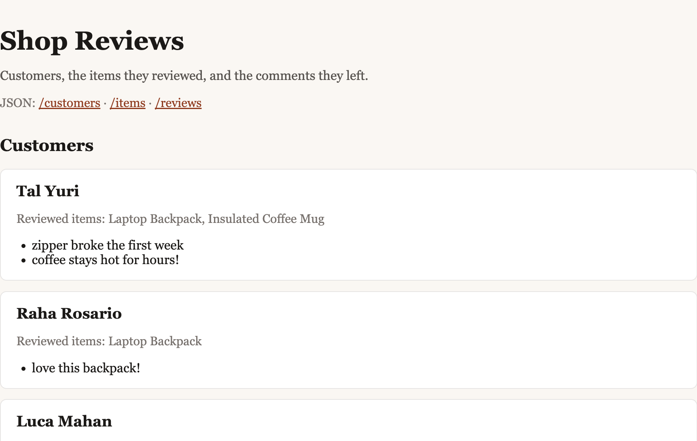

# Flask-SQLAlchemy Serialization

A small e-commerce API for customers, the items they review, and the comments they leave. SQLAlchemy models the relationships, and Marshmallow turns those graphs into JSON without looping forever through nested records.



## Data model

A review belongs to one customer and one item. A customer has many items through reviews, and an item has many customers through reviews.


| Model | Table | Relationships |
| --- | --- | --- |
| `Customer` | `customers` | `reviews`; `items` association proxy |
| `Item` | `items` | `reviews`; `customers` association proxy |
| `Review` | `reviews` | `customer`, `item` |

`Review` stores `comment`, `customer_id`, and `item_id`. Given a customer, `customer.items` returns the items they reviewed without walking the reviews by hand.

## Serialization

`CustomerSchema`, `ItemSchema`, and `ReviewSchema` include each model's own columns, including `id`, and omit foreign keys. Relationships use `fields.Nested`. Nested schemas drop the fields that would recurse:

- Nested customers omit `items` and `reviews`.
- Nested items omit `reviews` and `customers`.
- Nested reviews omit `item` and `customer`.

## Getting started

The Pipfile targets Python 3.8. This machine can install the same packages with Python 3.10:

```console
pipenv install --python 3.10
pipenv shell
cd server
flask db upgrade head
python seed.py
python app.py
```

If `python_full_version` 3.8.13 is already available, `pipenv install` is enough. The app listens on [http://127.0.0.1:5555](http://127.0.0.1:5555).

`python seed.py` loads three customers, three items, and five reviews. The development database is `server/instance/app.db`, which is gitignored.

## API

| Route | Response |
| --- | --- |
| `/` | HTML list of customers, their reviewed items, and item reviews |
| `/customers` | Customers, with reviews and items |
| `/items` | Items, with reviews and customers |
| `/reviews` | Reviews, with the customer and item for each comment |

## Tests

From the `server` directory:

```console
pytest
```

Tests cover the `Review` model, the `Customer.items` association proxy, and serialization. They run against an in-memory database, so they do not erase seeded data in `instance/app.db`.

## License

Educational content in this repository is covered by [LICENSE.md](LICENSE.md).
